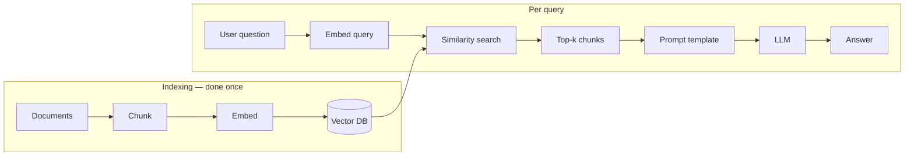

# Naive RAG

An LLM only knows what was baked into it at training time. Ask it about a document it's never seen — your company's refund policy, a contract you just signed, a paper published last week — and it either says so, or worse, answers confidently anyway from something that merely *sounds* related. Retrieval-Augmented Generation exists to fix this: instead of relying on what the model memorized, you hand it the relevant text at the moment it needs to answer, pulled fresh from a knowledge base you control.

**Naive RAG** is the simplest version of that idea — one retrieval pass, one generation pass, no loops, no quality checks, no second-guessing. It's not called "naive" as an insult; it's the baseline every other architecture on this site exists to improve on, and it's still the right choice for a surprising number of real use cases.

!!! example "Hands-on"
    Prefer to build this instead of reading about it? [**Build Naive RAG From Scratch →**](tutorials/naive-rag-from-scratch.md) — a runnable pipeline over a real PDF, pluggable across Anthropic, OpenAI, and local Ollama.

??? abstract "TL;DR — quick revision"
    - **Pipeline:** chunk → embed → store (offline, once) · embed query → similarity search → top-k → prompt → generate (online, per query)
    - **"Naive"** = one retrieve-then-generate pass, no loops, no reranking, no self-checks
    - **Five failure modes:** semantic similarity ≠ relevance · no query understanding · fixed top-k with no reranking · no groundedness check · can't handle multi-part questions
    - **Hard rule:** query and chunks must be embedded with the *exact same* embedding model, or similarity scores become meaningless
    - **Use it when:** small, clean, well-scoped KB, low-stakes lookups, prototyping
    - **Upgrade path:** Advanced RAG (pre/post-retrieval) is the cheapest next step for almost every one of these failure modes

## The core idea

Split your documents into chunks, turn each chunk into a vector that captures its meaning, and store those vectors. When a question comes in, turn the question into a vector too, and find the stored chunks whose vectors are closest to it — "closest" standing in for "most semantically similar." Stuff those chunks into the prompt, and let the LLM write an answer grounded in them instead of its own memory.



Two phases, run at very different times: **indexing** happens offline, once per document (or whenever the source changes); **retrieval + generation** happens online, once per user question, in milliseconds to a couple seconds.

## Walking through it

Say your knowledge base is a company handbook, and a chunk of it reads:

> *"Employees may work remotely up to 3 days per week with manager approval. International remote work requires HR approval and is limited to 30 days per year."*

**1. Indexing.** This chunk (along with every other chunk from every other document) gets run through an embedding model, producing a vector — a few hundred to a few thousand numbers that encode its meaning. That vector, plus the original chunk text and some metadata (source document, page number), gets stored in a vector database like FAISS or Milvus.

**2. Retrieval.** A user asks: *"How many days can I work internationally remote?"* That question gets embedded with the **same** embedding model used for indexing, and the vector DB returns the chunks whose vectors are nearest to it — usually by cosine similarity. The handbook chunk above should come back near the top, since "international remote work" and "internationally remote" land close together in vector space even though the wording differs.

**3. Augmentation.** The top-k retrieved chunks get dropped into a prompt template:

```text
Answer the question using only the context below.
Context: {retrieved_chunks}
Question: {user_query}
```

**4. Generation.** The LLM reads that prompt and writes an answer — ideally "up to 30 days per year, with HR approval" — grounded in the retrieved text rather than guessed from its training data.

That's the whole pipeline. No loop, no verification step, no re-ranking — whatever came back from similarity search is what the LLM sees, for better or worse.

## Where it breaks

The "for worse" part is the point of this page. Every one of these is a real failure mode, not a hypothetical:

- **Semantic similarity isn't the same as relevance.** A chunk can be embedding-close to the query and still not contain the answer. A query about *"refund policy for damaged items"* can retrieve a chunk about *"return policy for wrong-size items"* — same neighborhood in vector space, wrong answer in practice.
- **There's no query understanding.** A vague or oddly-phrased question, or one that uses different vocabulary than the source documents, can cause the similarity search to miss the right chunk entirely — the system has no way to notice the phrasing was the problem.
- **Top-k is fixed and unranked.** Whatever the nearest-neighbor search returns is used as-is. There's no second pass asking "which of these k chunks is *actually* most relevant" — noisy, tangential chunks dilute the context right alongside the good ones.
- **Nothing checks groundedness.** Nothing stops the LLM from hallucinating even with good context in front of it, and nothing stops it from confidently answering when the retrieved context has nothing useful — it should say "I don't know" here, but naive RAG never taught it to.
- **Multi-part questions don't work well.** A single query embedding represents one point in vector space. A question like *"compare X's pricing and Y's pricing"* is really two lookups wearing a trenchcoat, and one embedding can't represent both halves at once.

!!! tip "Framing for interviews"
    Every architecture covered elsewhere on this site — Advanced RAG, Modular RAG, Self-RAG, CRAG, Agentic RAG — exists to patch one or more of these exact five failure modes. None of it is sophistication for its own sake; each addition maps to a specific way naive RAG breaks.

## When naive RAG is actually the right call

Despite the list above, don't reflexively upgrade. Naive RAG is the correct choice for simple, well-scoped Q&A over a small, clean knowledge base — a FAQ bot, an internal wiki lookup, a prototype you're validating before investing further. The moment you're in production with real users, real-world phrasing, and any cost to being wrong, move at minimum to [Advanced RAG](advanced-rag-pre-retrieval.md)'s pre- and post-retrieval techniques — they're the cheapest, highest-leverage upgrades from here.

## Scenario Check

Six scenario-based questions to test whether the failure modes above actually stuck — the kind of "what would happen if..." framing that tends to come up in system-design interviews. Nothing here is stored or scored beyond this page view; it's just a self-check.

<div class="quiz-widget" data-title="Scenario Check: Naive RAG">
<script type="application/json">
{
  "questions": [
    {
      "scenario": "Your naive RAG system indexes an e-commerce FAQ. A user asks: \"Can I get money back for a damaged item?\" The system retrieves — and confidently answers from — a chunk titled \"Return Policy for Wrong-Size Items,\" which never mentions damaged items or refunds specifically.",
      "question": "What's the most likely root cause?",
      "options": [
        "The embedding model is too small to capture domain vocabulary.",
        "The chunk was embedding-close to the query because \"return,\" \"policy,\" and general phrasing overlap — semantic similarity isn't the same as relevance.",
        "The vector database's approximate nearest-neighbor search returned an inexact match.",
        "The LLM ignored the retrieved context and hallucinated the topic."
      ],
      "correct": 1,
      "explanations": [
        "Possible in principle, but this example is specifically about a semantically-close-but-wrong-topic match, not vocabulary coverage — a bigger embedding model wouldn't fix a genuinely close-but-irrelevant chunk.",
        "Correct. This is naive RAG's core failure mode: a chunk can be embedding-close to the query without containing the answer, because embedding similarity measures topical closeness, not whether a chunk actually answers the question.",
        "ANN approximation error is real, but it wouldn't consistently surface a topically-similar-but-wrong chunk like this one — that's a relevance problem, not a nearest-neighbor accuracy problem.",
        "The scenario describes the model faithfully using the (wrong) retrieved chunk — that's a retrieval problem, not a generation/hallucination problem."
      ]
    },
    {
      "scenario": "A team upgrades to a new embedding model but only has time to re-embed half their knowledge base before the next release. Both old-model and new-model vectors end up sitting in the same FAISS index.",
      "question": "What happens at query time?",
      "options": [
        "Retrieval degrades unpredictably — vectors from two different models aren't comparable, so similarity scores against the \"wrong-model\" chunks are meaningless.",
        "Nothing changes — FAISS automatically detects which model produced each vector and adjusts.",
        "Retrieval silently skips the old vectors and only searches the new ones.",
        "The system throws an error and refuses to run any search."
      ],
      "correct": 0,
      "explanations": [
        "This isn't quite it — while it sounds bad, the real story is worse: nothing detects the mismatch at all, so the failure is silent and unpredictable rather than a clean skip.",
        "Correct. This is a hard rule: index-time and query-time embeddings must come from the exact same model. Mixing models means vectors live in incomparable vector spaces — distances between them carry no real meaning, and retrieval quality degrades unpredictably as a result.",
        "FAISS has no concept of \"which model produced this vector\" — it just does math on whatever numbers you give it. There's no such filtering.",
        "FAISS won't error here — dimensionality likely still matches (same output size for many embedding model families), so the search runs and returns confidently wrong results, which is more dangerous than a loud crash."
      ]
    },
    {
      "scenario": "A user asks a single-pass naive RAG system: \"How does our refund policy compare to our warranty policy for electronics?\"",
      "question": "Why does naive RAG typically struggle here, specifically?",
      "options": [
        "The vector database can't hold two different topics in one index.",
        "One query embedding has to represent two distinct information needs at once, diluting the search toward a blurry middle instead of surfacing chunks strongly relevant to either topic.",
        "The LLM's context window is too small to hold two policies.",
        "Refund and warranty chunks are stored in separate, unlinked vector databases."
      ],
      "correct": 1,
      "explanations": [
        "A vector DB is topic-agnostic — it just stores vectors. There's no structural limit on holding multiple topics in one index.",
        "Correct. This is the multi-part-question failure mode: a single embedding is one point in vector space, and a compound question like this has no single \"topic\" to embed toward — retrieval gets diluted across both halves instead of nailing either.",
        "Context window size isn't the bottleneck — retrieval happens before generation, and it's retrieval that fails to surface both sets of relevant chunks in the first place.",
        "Nothing in naive RAG assumes separate databases per topic — that's not a real constraint of the architecture."
      ]
    },
    {
      "scenario": "Top-k is set to 5 for a query. Two of the five retrieved chunks are highly relevant, one is tangentially related, and two are near-duplicate chunks about an unrelated topic that happened to score just above the cutoff.",
      "question": "What does naive RAG do with this mix, and why?",
      "options": [
        "It automatically re-ranks the 5 and drops the 2 unrelated chunks before generation.",
        "It passes all 5 to the LLM as-is — there's no second pass checking which of the k chunks are actually most relevant, so noisy chunks dilute the context alongside the good ones.",
        "It raises the similarity threshold automatically and re-queries for cleaner results.",
        "It merges the 2 near-duplicate chunks into one before generation."
      ],
      "correct": 1,
      "explanations": [
        "This is exactly what naive RAG lacks — that re-ranking step is what Advanced RAG's post-retrieval techniques (cross-encoder reranking) add on top of this baseline.",
        "Correct. Naive RAG uses whatever top-k the similarity search returns, unmodified — no verification, no reranking, no filtering. The LLM sees the good and the noisy chunks together, with no signal distinguishing them.",
        "There's no adaptive thresholding or re-query loop in naive RAG — it's a one-shot pipeline by definition, retrieve once and move on.",
        "No deduplication step exists either — near-duplicates simply take up two of the k slots that could've gone to something more useful."
      ]
    },
    {
      "scenario": "A question is asked that the knowledge base genuinely has no good answer for. The top-5 retrieved chunks are all weakly related at best — but they're still \"the top 5\" by definition, since similarity search always returns *something*.",
      "question": "What's the most likely outcome in a naive RAG system, and why?",
      "options": [
        "The system correctly responds \"I don't know,\" since low similarity scores are automatically detected and flagged.",
        "The system likely still generates a confident-sounding answer from the weak chunks, because nothing checks whether the retrieved context is actually good enough before generation runs.",
        "Generation is skipped entirely once similarity drops below a built-in default threshold.",
        "The vector database returns zero results when nothing relevant actually exists."
      ],
      "correct": 1,
      "explanations": [
        "Naive RAG has no groundedness or confidence check by default — \"I don't know\" only happens if the LLM independently chooses to say so, not because the system detected weak retrieval and intervened.",
        "Correct. This is the \"no groundedness check\" failure mode: naive RAG always passes through whatever top-k came back, however weak, and generation proceeds as if it were good context. This is exactly what CRAG's correct/incorrect/ambiguous evaluator and Self-RAG's relevance grading exist to catch.",
        "There's no default threshold gating generation in a one-shot naive pipeline — top-k is top-k regardless of the absolute similarity score.",
        "Vector search always returns the k nearest vectors that exist, regardless of how (ir)relevant they actually are — \"nearest\" doesn't mean \"relevant,\" and it never returns nothing just because nothing is a great match."
      ]
    },
    {
      "scenario": "A small internal team builds a bot that answers questions strictly from a 10-page onboarding FAQ that rarely changes. Questions are short, well-phrased, and almost always map cleanly to exactly one FAQ entry.",
      "question": "Is naive RAG a reasonable architecture choice here?",
      "options": [
        "No — Advanced RAG's pre- and post-retrieval techniques are the cheapest, highest-leverage upgrade from this baseline, so a production system should adopt at least reranking by default before shipping.",
        "Yes — this is precisely the well-scoped, low-stakes, simple-lookup scenario where naive RAG's simplicity is a feature, not a liability.",
        "No — naive RAG only works reliably on knowledge bases larger than roughly 100 pages.",
        "Yes, but only if the team also adds Agentic RAG's ReAct loop for safety."
      ],
      "correct": 1,
      "explanations": [
        "That upgrade advice is conditioned on messy real-world phrasing and a real cost to being wrong — a static 10-page FAQ with clean, well-matched single-intent queries doesn't have the failure modes reranking or query rewriting would fix, so paying that latency/complexity cost here buys nothing.",
        "Correct. Small, static KB with well-matched, single-intent queries is exactly naive RAG's sweet spot. Adding complexity here means paying latency and cost for failure modes that don't actually occur in this use case.",
        "There's no size floor for naive RAG — smaller, well-scoped knowledge bases are actually where it performs best, since there's less room for retrieval to go wrong.",
        "Agentic RAG solves a completely different problem — open-ended, multi-hop, multi-source questions. It would be pure overhead here, not a \"safety\" addition, for a bot answering single-lookup FAQ questions."
      ]
    }
  ]
}
</script>
</div>
