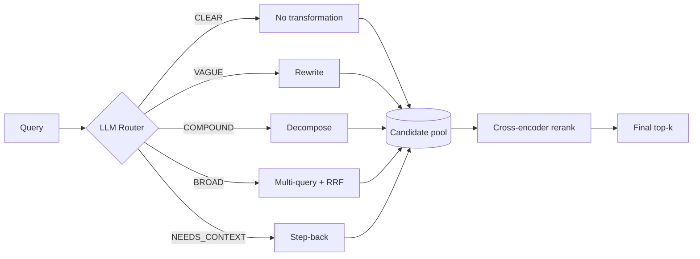

# Build Adaptive RAG From Scratch

Naive RAG treats every query the same way. The [pre-retrieval](../advanced-rag-pre-retrieval.md) and [post-retrieval](../advanced-rag-post-retrieval.md) pages each measured their techniques individually and found the same pattern over and over: a technique that fixes one specific failure mode does nothing — or actively hurts — on a query that doesn't have that failure mode. This tutorial builds the natural next step: an LLM **router** that looks at each query first, decides what (if anything) is wrong with it, and applies only the matching fix before retrieval — then reranks the result.

The code lives in [`rag-cookbook/adaptive-rag/`](https://github.com/DhruvMakwana/rag-cookbook/tree/main/adaptive-rag); every block below is pulled live from those exact files at build time.

!!! note "Read these first"
    This tutorial assumes you've read [Advanced RAG — Pre-retrieval](../advanced-rag-pre-retrieval.md) and [Advanced RAG — Post-retrieval](../advanced-rag-post-retrieval.md) — it reuses their techniques and their measured scenarios directly, and doesn't re-explain how each one works internally.

## What you'll build



Five categories, each mapped to a technique already measured on its own: a query that's already clear gets no transformation at all (the honest majority case); a vague, colloquial query gets rewritten; a compound question gets decomposed; a broad, multi-faceted question gets multi-query + RRF; a narrow parameter value gets step-back's broader context added alongside it. Every candidate pool then goes through the same cross-encoder reranking stage before the final top-k comes out.

## 1. Install

```bash
git clone https://github.com/DhruvMakwana/rag-cookbook.git
cd rag-cookbook/adaptive-rag
python3 -m venv .venv && source .venv/bin/activate
pip install -r requirements.txt
```

```
--8<-- "https://raw.githubusercontent.com/DhruvMakwana/rag-cookbook/main/adaptive-rag/requirements.txt"
```

## 2. Configure your LLM

```bash
cp .env.example .env
```

Every stage of this pipeline that isn't pure vector math makes an LLM call — the router included — so pick a provider and fill in `.env` the same way as every other recipe on this site.

## 3. The router

```python
--8<-- "https://raw.githubusercontent.com/DhruvMakwana/rag-cookbook/main/adaptive-rag/adaptive_rag_docs.py:router"
```

One LLM call classifies the query into exactly one of 5 categories, each with a one-line example baked directly into the prompt. That's not decoration — an earlier version of this prompt used definitions alone (no examples), and it confused `CLEAR` with `NEEDS_CONTEXT` and `VAGUE` with `BROAD` on the very queries meant to demonstrate each category. Adding one concrete example per category fixed all of it: 5/5 correct, stable across repeated runs, and correctly generalizing to novel queries never shown in the prompt (tested separately — a colloquially-phrased "why not just make it bigger" question still correctly routes to `VAGUE`, a genuinely open-ended "why is this more interpretable" question still routes to `BROAD`).

The category comes back wrapped in `<category>` tags — the same pattern used for [listwise reranking](../advanced-rag-post-retrieval.md#llm-based-listwise-reranking): let the model reason if it wants, give it one unambiguous place to put the actual answer.

## 4. The full pipeline

```python
--8<-- "https://raw.githubusercontent.com/DhruvMakwana/rag-cookbook/main/adaptive-rag/adaptive_rag_docs.py:pipeline"
```

Route, apply the matching pre-retrieval technique, rerank. Two design decisions in this function only became visible once the *whole* pipeline was tested end-to-end — neither the pre-retrieval page nor the post-retrieval page had any reason to surface them, because each tested its own technique's own top-k directly, with no second stage stacked on top:

**A cross-encoder has the same vocabulary-mismatch problem a bi-encoder does.** For a `VAGUE` query, if the final reranking step scores candidates against the *original* colloquial wording instead of the rewritten one, it throws away the exact fix rewriting just made — the reranker reads the raw query, doesn't recognize the technical passage as a match, and can rank it out of the final top-k even though it's sitting right there in the candidate pool. The fix: `VAGUE` reranks against the rewritten query, not the original.

**Reranking a decomposed question's merged pool against one query undoes decomposition's whole point.** `COMPOUND` retrieval gathers a candidate pool per sub-question specifically so neither fact crowds out the other. Rerank that merged pool with a single cross-encoder pass scored against the full compound question, and it collapses right back down to whichever sub-topic the reranker happens to think is more relevant — silently dropping the other fact with no error. The fix: `COMPOUND` reranks *per sub-question*, with a guaranteed minimum number of slots for each one, before combining.

## Run it

```bash
python adaptive_rag.py --query "What optimizer did they use for training?"
python adaptive_rag.py --compare
```

`--compare` runs 5 queries — one per router category, each reusing a scenario already keyword-verified on the pre-retrieval page — through both naive retrieval and the full adaptive pipeline, and prints a three-column comparison: whether naive found the answer, whether the pipeline's pre-retrieval step got it into the candidate pool, and whether it survived all the way to the final output.

**Actual output:**

```text
Question                                                Category       Naive   Pool    Final
----------------------------------------------------------------------------------------------
What optimizer did they use for training?               CLEAR          True    True    True
why dont they just use RNNs like everyone else did...   VAGUE          False   True    False
What optimizer did they use, and how many attentio...   COMPOUND       False   True    True
What lets this model connect words that are far ap...   BROAD          False   True    False
What value did they use for Pdrop during training?      NEEDS_CONTEXT  True    True    True
```

## What this table actually shows

Three of five queries work end-to-end: `CLEAR` and `NEEDS_CONTEXT` correctly get routed to little-or-no transformation and tie naive retrieval (no harm on queries that didn't need fixing); `COMPOUND` is a clean win, with the per-sub-question reranking fix from above doing real work.

The other two are the more interesting result. `VAGUE` and `BROAD` both show **Pool = True, Final = False** — the router correctly diagnosed the query, correctly applied the fix, and the fix genuinely worked: the target passage entered the candidate pool, something naive retrieval never achieved on either query. And then cross-encoder reranking, scored fairly against the right query, still didn't promote it into the final top-3. This isn't a bug being papered over — it was checked directly: widening the final budget from top-3 to top-5 didn't recover it either. The cross-encoder simply disagrees with what's actually the most precise answer, favoring more general, topically-adjacent passages over the one with the exact technical justification.

That's the honest lesson this whole tutorial builds toward: **stacking techniques is not automatically monotonic.** Fixing recall at one stage doesn't guarantee precision at the next one — every stage in a pipeline needs its own verification, not just each individual technique tested in isolation the way the earlier pages did. A pipeline that looks correct stage-by-stage can still lose a fix between stages, silently, with no error thrown anywhere.

## Adding contextual compression

Compression isn't wired into the default pipeline — it's a separate cost/quality trade-off that not every query needs (same reasoning as the [post-retrieval page](../advanced-rag-post-retrieval.md#contextual-compression)). Add it as a final step with a flag:

```bash
python adaptive_rag.py --query "What optimizer did they use for training?" --compress
```

## Where this still breaks

- **The router itself can misclassify.** It's one LLM call with no verification step — a genuinely ambiguous query could land in the wrong category, applying the wrong fix (or none) to a query that needed one.
- **Reranking's final-stage loss on `VAGUE`/`BROAD` is unresolved, not just undocumented.** This tutorial reports it honestly rather than tuning parameters until it disappears — a real production system would need to either accept a wider final-k for transformed queries, try a different reranker, or measure whether this specific tension shows up on its own corpus at all.
- **This pipeline never checks whether retrieval actually found anything usable before generating.** That's a different failure mode entirely — see [Self-RAG](../self-rag.md) and [Corrective RAG](../corrective-rag.md) for retrieval-quality checks that happen *after* this whole pipeline runs, not before.

## Sources & further reading

- [Advanced RAG — Pre-retrieval](../advanced-rag-pre-retrieval.md) — every technique the router can route to, measured individually
- [Advanced RAG — Post-retrieval](../advanced-rag-post-retrieval.md) — the cross-encoder reranking stage this pipeline always applies
- [Adaptive-RAG: Learning to Adapt Retrieval-Augmented Large Language Models through Question Complexity](https://arxiv.org/abs/2403.14403) — the research this router pattern is named after and loosely modeled on
