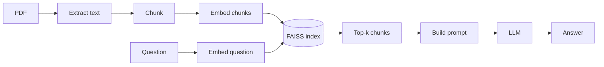

# Build Naive RAG From Scratch

A minimal, dependency-light naive RAG pipeline — PDF → chunk → embed → index → retrieve → generate — with no LangChain/LlamaIndex in the way, so every step stays visible. The code lives in [`rag-cookbook/naive-rag/`](https://github.com/DhruvMakwana/rag-cookbook/tree/main/naive-rag); every block below is pulled live from those exact files at build time, so what you read here is always exactly what runs.

If you haven't yet, read [Naive RAG](../naive-rag.md) first for the concepts — this page is the "now build it" companion, and deliberately skips re-explaining *why* each step exists.

!!! note "What this deliberately keeps simple"
    Chunking here is plain fixed-size splitting, and the vector index is a brute-force FAISS flat index. Both are covered properly — with better alternatives — on the [Chunking Strategies](../chunking.md) and [Vector Databases](../vector-databases.md) pages. This tutorial is about the pipeline's shape, not about picking the best technique at each stage.

## What you'll build



Sample data is ["Attention Is All You Need"](https://arxiv.org/abs/1706.03762) (Vaswani et al., 2017), downloaded at run time — a short, well-structured technical PDF that's freely available and widely used as sample data across RAG tutorials for exactly this reason. Swap in your own PDF any time (covered at the end).

## 1. Install

```bash
git clone https://github.com/DhruvMakwana/rag-cookbook.git
cd rag-cookbook/naive-rag
python3 -m venv .venv && source .venv/bin/activate
pip install -r requirements.txt
```

```
--8<-- "https://raw.githubusercontent.com/DhruvMakwana/rag-cookbook/main/naive-rag/requirements.txt"
```

`sentence-transformers` pulls in PyTorch — expect a few hundred MB to download and a couple of minutes, one time only.

## 2. Configure your LLM

```bash
cp .env.example .env
```

```
--8<-- "https://raw.githubusercontent.com/DhruvMakwana/rag-cookbook/main/naive-rag/.env.example"
```

`.env` is git-ignored — it never gets committed, and the code never prints or logs its contents. Three interchangeable providers are supported, picked via `LLM_PROVIDER`:

- **Anthropic or OpenAI** — paste your key in, nothing else to configure.
- **Ollama** — fully local, no key needed, no cost. Install [Ollama](https://ollama.com), run `ollama pull llama3.1` once, set `LLM_PROVIDER=ollama`. Good for testing the pipeline before spending anything on a hosted API, or for readers following along without an API key at all.

## 3. Fetch the sample data

```python
--8<-- "https://raw.githubusercontent.com/DhruvMakwana/rag-cookbook/main/naive-rag/download_data.py"
```

Nothing exotic — download once, cache under `data/` (git-ignored, so the PDF itself never ends up in the repo either). Point `PDF_PATH` at your own file instead any time; see [Using your own PDF](#using-your-own-pdf).

## 4. Extract text from the PDF

```python
--8<-- "https://raw.githubusercontent.com/DhruvMakwana/rag-cookbook/main/naive-rag/rag_naive.py:load_pdf"
```

[`pypdf`](https://pypdf.readthedocs.io/) walks every page and pulls out its text layer. This only works for PDFs with an actual text layer — a scanned document with no OCR would return empty strings here. (That failure mode is exactly what motivates [Vision-RAG](../vision-rag.md) later on.)

## 5. Chunk it

```python
--8<-- "https://raw.githubusercontent.com/DhruvMakwana/rag-cookbook/main/naive-rag/rag_naive.py:chunk_text"
```

Fixed-size, character-based, with overlap — the simplest strategy that exists, on purpose. This is the one step you'll almost certainly want to upgrade first; see [Chunking Strategies](../chunking.md) for what to reach for and when.

## 6. Embed the chunks

```python
--8<-- "https://raw.githubusercontent.com/DhruvMakwana/rag-cookbook/main/naive-rag/rag_naive.py:embed"
```

`all-MiniLM-L6-v2` via [sentence-transformers](https://www.sbert.net/) — small (~80MB), fast on CPU, runs fully locally so indexing never needs an API key. Embeddings are L2-normalized so a plain inner-product search below is equivalent to cosine similarity, without computing norms at query time.

## 7. Build the vector index

```python
--8<-- "https://raw.githubusercontent.com/DhruvMakwana/rag-cookbook/main/naive-rag/rag_naive.py:build_index"
```

A flat FAISS index does brute-force exact search — perfectly fine at hundreds of chunks. It stops being fine in the millions; see [Vector Databases](../vector-databases.md) for ANN indexes (HNSW, IVF) and when to reach for a real vector DB instead of an in-process index.

## 8. Retrieve

```python
--8<-- "https://raw.githubusercontent.com/DhruvMakwana/rag-cookbook/main/naive-rag/rag_naive.py:retrieve"
```

The query gets embedded with the *same* model used for the chunks (non-negotiable — see the embedding model page's one hard rule), then FAISS returns the `k` nearest chunks by cosine similarity.

## 9. Build the prompt

```python
--8<-- "https://raw.githubusercontent.com/DhruvMakwana/rag-cookbook/main/naive-rag/rag_naive.py:prompt"
```

Deliberately blunt: answer only from context, say "I don't know" rather than guess. No citation formatting, no chain-of-thought scaffolding — see [Response Quality & Safety](../response-quality-safety.md) for hardening this properly.

## 10. Generate — pluggable across providers

```python
--8<-- "https://raw.githubusercontent.com/DhruvMakwana/rag-cookbook/main/naive-rag/llm.py:provider_dispatch"
```

Each provider is one small function behind a common interface:

=== "Anthropic"
    ```python
    --8<-- "https://raw.githubusercontent.com/DhruvMakwana/rag-cookbook/main/naive-rag/llm.py:provider_anthropic"
    ```
=== "OpenAI"
    ```python
    --8<-- "https://raw.githubusercontent.com/DhruvMakwana/rag-cookbook/main/naive-rag/llm.py:provider_openai"
    ```
=== "Ollama (local, free)"
    ```python
    --8<-- "https://raw.githubusercontent.com/DhruvMakwana/rag-cookbook/main/naive-rag/llm.py:provider_ollama"
    ```

## Run it

```bash
python rag_naive.py "What is multi-head attention?"
```

First run downloads the PDF, chunks and embeds it, and caches a FAISS index under `data/`; later runs reuse that cache. Force a rebuild with `--rebuild`, change how many chunks get retrieved with `--k`, or override the provider per-call:

```bash
python rag_naive.py "What optimizer did they use?" --provider openai --k 6
```

**Example output** (Anthropic, default settings):

```text
$ python rag_naive.py "What is multi-head attention and why do they use 8 heads?"

Multi-head attention allows the model to jointly attend to information from
different representation subspaces at different positions. It works by
computing multiple attention heads in parallel (h=8 in this work), where
each head performs attention with its own learned projection matrices...

They use 8 heads with reduced per-head dimensions (dk = dv = dmodel/h = 64),
which keeps the total computational cost similar to single-head attention
with full dimensionality while gaining the representational benefit of
attending to multiple subspaces at once.
```

## Using your own PDF

```bash
export PDF_PATH=/path/to/your.pdf
python rag_naive.py "your question" --rebuild
```

`--rebuild` is required the first time you point at a different PDF — otherwise the pipeline happily serves answers from whatever was cached under `data/` last.

## Where this breaks (and what fixes each break)

This is *naive* RAG — the failure modes are the point, not a bug list to feel bad about:

| Try asking... | What happens | Why | Fixed by |
|---|---|---|---|
| A vague or oddly-phrased question | Weak/irrelevant retrieval | Vocabulary mismatch between query and document phrasing | [HyDE](../advanced-rag-pre-retrieval.md), [query rewriting](../advanced-rag-pre-retrieval.md) |
| A compound "compare X and Y" question | Retrieval blurs across both | One embedding can't represent two different information needs | [Query decomposition](../advanced-rag-pre-retrieval.md) |
| A question the PDF doesn't answer | A confident-sounding wrong answer, sometimes | Nothing checks whether retrieval actually found anything relevant | [Self-RAG](../self-rag.md), [CRAG](../corrective-rag.md) |
| A question needing 2+ scattered facts | Right facts retrieved, ranked poorly, one gets cut off at `k` | No re-ranking, no compression, fixed top-k | [Reranking, compression](../advanced-rag-post-retrieval.md) |

Full failure-mode discussion: [Naive RAG](../naive-rag.md#where-it-breaks).
